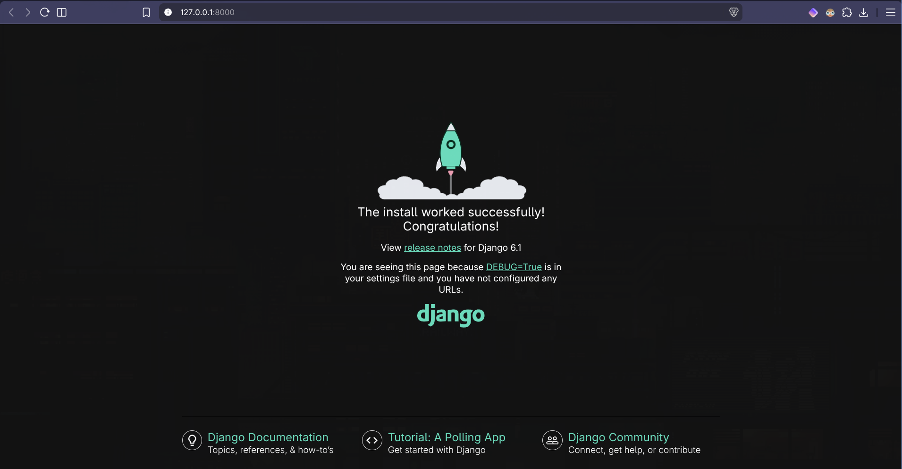

# Programmatūras izstrādes tehnoloģiju projekts

Studiju projekts: tīmekļa platforma, kurā fotogrāfi var kopīgot fotogrāfijas ar saviem klientiem.

## Tehnoloģijas

- [Python 3.13](https://www.python.org/downloads/release/python-3130/),
- [Django 6.1](https://www.djangoproject.com/) - augsta līmeņa Python tīmekļa ietvars (lejupielādējama pakotne Python)
- [uv rīks](https://docs.astral.sh/uv/) – Python, virtuālās vides un atkarību pārvaldība (lietosim pip vietā, vieglāk sinhronizēt pakotnes)
- [SQLite](https://sqlite.org/) – lietotāju un saziņu datu uzglabāšanai (noklusējums Django)
- [Silo Dockerī](https://hub.docker.com/r/pgsty/silo) - objektu krātuve (object storage) fotogrāfiju glabāšanai (plānots)

## Īsumā

Ja **Git** un **uv** jau ir uzstādīti, projektu var palaist ar šīm komandām (vienādas visās operētājsistēmās un termināļos):

```bash
git clone https://github.com/elaraisav/26_pit-projekts_rtu.git
cd 26_pit-projekts_rtu
uv sync
uv run python scripts/setup_env.py
uv run python manage.py migrate
uv run python manage.py runserver
```

Tad atver <http://127.0.0.1:8000/>. Sīkāks apraksts – zemāk.

Vienīgā komanda, kas ir nestandarta ir `uv run python scripts/setup_env.py`. Šī komanda palaiž skriptu, kas automatizē `.env` izveidi un aizpildi. 

Pat, ja visi nepieciešamie rīki ir uzstādīti, lūgums, pārskati pārējo instrukciju saturu.  

## 1. Nepieciešamie rīki

| Rīks | Windows | macOS | Linux |
|---|---|---|---|
| Git | `winget install --id Git.Git -e` vai [git-scm.com](https://git-scm.com/downloads) | `xcode-select --install` vai `brew install git` | distribūcijas pakotņu pārvaldnieks |
| uv | `winget install --id=astral-sh.uv -e` | `brew install uv` | `curl -LsSf https://astral.sh/uv/install.sh \| sh` |

Citi uv uzstādīšanas veidi: [uv dokumentācija](https://docs.astral.sh/uv/getting-started/installation/).

Pēc uzstādīšanas **aizver un no jauna atver termināli** (arī VS Code vai PyCharm), citādi jaunās komandas netiks atrastas. Pārbaudi:

```bash
git --version
uv --version
```

Python atsevišķi uzstādīt nav nepieciešams – `uv sync` atradīs projektā lietotās verijas un pats lejupielādēs Python 3.13, ja tā nav.

## 2. Projekta lejupielāde

Izvēlies mapi, kurā glabāsi projektu. **Windows:** neizmanto OneDrive sinhronizētas mapes (bieži tās ir *Desktop* un *Documents*) – `.venv` mapē ir tūkstošiem failu, un sinhronizācija rada kļūdas. Piemērs: `C:\dev\`.

Dažas projekta lejupielādes iespējas:

- **Terminālis:** atver termināli izvēlētajā mapē un izpildi
  ```bash
  git clone https://github.com/elaraisav/26_pit-projekts_rtu.git
  cd 26_pit-projekts_rtu
  ```
- **VS Code:** `Ctrl+Shift+P` (macOS: `Cmd+Shift+P`) → **Git: Clone** → ielīmē adresi `https://github.com/elaraisav/26_pit-projekts_rtu.git` → izvēlies mapi → **Open**.
- **PyCharm:** **File → New → Project from Version Control** (vai sākuma logā **Get from VCS**) → ielīmē adresi → **Clone**.
- **GitHub Desktop:** **File → Clone repository → URL** → ielīmē adresi → **Clone**.

Tālākās komandas izpildi terminālī, kas atvērts projekta mapē. VS Code un PyCharm tas ir iebūvētais terminālis (**Terminal → New Terminal** / **View → Tool Windows → Terminal**), GitHub Desktop – **Repository → Open in Terminal** (Windows: **Open in Command Prompt**).

## 3. Uzstādīšana

<details>
<summary><strong>Ja lieto mise</strong> (neobligāti – izpildi pirms uzstādīšanas komandām)</summary>

[mise](https://mise.jdx.dev/) ir rīku versiju pārvaldnieks. Projektā esošais `mise.toml` uzstāda Python 3.13 un uv, kā arī automātiski aktivizē `.venv`, kad atver projekta mapi. Ar mise uv atsevišķi uzstādīt nav nepieciešams.

Pirms mise atļauj izmantot projekta konfigurāciju, to jāapstiprina. Vispirms apskati faila saturu (Windows cmd: `type mise.toml`):

```bash
cat mise.toml
mise trust
mise install
```

</details>

```bash
uv sync
uv run python scripts/setup_env.py
uv run python manage.py migrate
```

- `uv sync` – izveido `.venv` mapi ar Python 3.13 un tieši tām atkarību versijām, kas norādītas `uv.lock`.
- `scripts/setup_env.py` – izveido `.env` failu no `.env.example` un ieraksta tajā jaunu, tikai tev piederošu slepeno atslēgu.
- `migrate` – izveido lokālo datubāzi `db.sqlite3`. Veiksmīgā gadījumā parādīsies vairākas rindas `Applying … OK`.

Virtuālā vide nav jāaktivizē – `uv run` to izmanto automātiski. Visas projekta komandas raksti ar `uv run` priekšā.

### Ja `.env` jāizveido manuāli

`scripts/setup_env.py` to izdara automātiski. Ja tomēr vajag ar roku:

1. Nokopē `.env.example` uz `.env` (macOS/Linux/PowerShell: `cp .env.example .env`, Windows cmd: `copy .env.example .env`).
2. Ģenerē atslēgu:
   ```bash
   uv run python -c "from django.core.management.utils import get_random_secret_key; print(get_random_secret_key())"
   ```
3. Ielīmē to `.env` failā vienpēdiņās: `DJANGO_SECRET_KEY='...'`.

`.env` rediģē ar koda redaktoru (VS Code, PyCharm, Notepad). **Neizmanto macOS TextEdit** – tas aizstāj pēdiņas ar „gudrajām" pēdiņām un var saglabāt failu RTF formātā. macOS Finder faili, kuru nosaukums sākas ar punktu, pēc noklusējuma ir paslēpti – parāda tos ar `Cmd+Shift+.`.

## 4. Palaišana

```bash
uv run python manage.py runserver
```

Terminālī parādīsies brīdinājums `WARNING: This is a development server…` – lokālajai izstrādei to var ignorēt.

Atver <http://127.0.0.1:8000/>. Ja viss izdevies, redzēsi šo lapu:



Serveri aptur terminālī ar `Ctrl+C` (arī macOS – Control, nevis Command).

## Darbs redaktorā

Redaktoram jānorāda Python interpretators no projekta `.venv` mapes, lai darbotos koda papildināšana un kļūdu pārbaude.

**VS Code**

1. Uzstādi paplašinājumu **Python** (Microsoft): **Extensions** (`Ctrl+Shift+X`) → meklē „Python".
2. Pēc `uv sync`: `Ctrl+Shift+P` → **Python: Select Interpreter** → izvēlies `.venv`.
3. Ja VS Code piedāvā **Create Environment** – atsakies. Vidi izveido `uv sync`; VS Code izveidotā vide neievērotu `uv.lock` versijas.

**PyCharm**

Jaunākās versijas atpazīst `uv.lock` un piedāvā uv vidi. Ja nē: **Settings → Project → Python Interpreter → Add Interpreter → Add Local Interpreter → Select existing** → `.venv`. Serveri var palaist terminālī vai ar Python palaišanas konfigurāciju: skripts `manage.py`, parametri `runserver`.

`.env` failu ielādē pats `settings.py`, tāpēc redaktorā nekas papildus nav jāiestata.

## Problēmu novēršana

| Kļūda | Iemesls | Risinājums |
|---|---|---|
| `…/.env was not found and DJANGO_SECRET_KEY is not set…` | Nav `.env` faila projekta saknē (blakus `manage.py`) | Izpildi `scripts/setup_env.py` vai izveido `.env` manuāli |
| `DJANGO_SECRET_KEY is missing or empty in …/.env` | `.env` ir, bet atslēga nav ierakstīta | Ģenerē atslēgu un ielīmē to (skat. „Ja `.env` jāizveido manuāli") |
| `.env already exists, not overwriting it.` | `.env` jau ir izveidots | Viss kārtībā – turpini ar `migrate` |
| `uv` / `git` netiek atrasts (`not recognized`, `command not found`) | Terminālis atvērts pirms rīka uzstādīšanas | Aizver un no jauna atver termināli vai redaktoru |
| `ModuleNotFoundError: No module named 'django'` | Komanda palaista bez `uv run` | Raksti `uv run` priekšā, piemēram, `uv run python manage.py runserver` |
| `running scripts is disabled on this system` (PowerShell) | VS Code mēģina aktivizēt `.venv` ar `Activate.ps1` | Var ignorēt – `uv run` aktivizācija nav vajadzīga. Lai paziņojums pazustu: `Set-ExecutionPolicy -Scope CurrentUser RemoteSigned` |
| `python` atver Microsoft Store (Windows) | Palaists sistēmas `python`, nevis projekta | Izmanto `uv run python` |
| `Error: That port is already in use.` | Serveris jau darbojas citā terminālī | Aizver to vai palaid citā portā: `runserver 8001` |

## Vides mainīgie

Iestatījumi, kas atšķiras starp datoriem, glabājas `.env` failā (paraugs – `.env.example`).

| Mainīgais | Obligāts | Apraksts |
|---|---|---|
| `DJANGO_SECRET_KEY` | jā | Katrs izstrādātājs ģenerē savu. Bez tā projekts nepalaižas. |
| `DJANGO_DEBUG` | nē | Ja nav norādīts – izslēgts. `.env.example` to lokāli ieslēdz. |
| `DJANGO_ALLOWED_HOSTS` | nē | Ar komatu atdalīts saraksts. Lokāli var atstāt tukšu. |

`.env` un `db.sqlite3` ir iekļauti `.gitignore` – tos nekad nepievieno repozitorijam. Atslēga nav jādala ar citiem: katram sava.

## Atkarību pievienošana

Pakotnes pievieno un noņem tikai ar uv – tas vienlaikus atjauno `pyproject.toml` un `uv.lock`:

```bash
uv add <pakotne>
uv remove <pakotne>
```

Abus failus (`pyproject.toml` un `uv.lock`) iekļauj vienā commit ar kodu, kas pakotni izmanto. Pēc `git pull` citi atjauno savu vidi ar `uv sync`.

**Neizmanto `pip install` vai `uv pip install`** – tie uzstāda pakotni tikai tavā datorā un to nekur nepieraksta, tāpēc citiem projekts nestrādās.

## Projekta struktūra

```
26_pit-projekts_rtu/
├── .github/
│   ├── workflows/
│   │   └── codeql.yml       Automātiska koda drošības analīze GitHub pusē
│   └── dependabot.yml       Automātiski atkarību atjauninājumu pieprasījumi
├── docs/
│   └── assets/              Attēli README failam
├── photo_client_site/       Django projekta konfigurācija
│   ├── __init__.py          Padara mapi par Python pakotni
│   ├── asgi.py              Ieejas punkts ASGI serverim (izvietošanai)
│   ├── settings.py          Iestatījumi; slepenās vērtības nolasa no .env
│   ├── urls.py              Galvenā URL maršrutēšana
│   └── wsgi.py              Ieejas punkts WSGI serverim (izvietošanai)
├── scripts/
│   └── setup_env.py         Izveido .env ar jaunu slepeno atslēgu
├── temp/                    Pagaidu faili CodeQL darbībai (tiks dzēsti)
├── .env.example             Vides mainīgo paraugs
├── .gitignore               Faili, kurus Git neseko
├── LICENSE                  MIT licence
├── manage.py                Django komandas: runserver, migrate u. c.
├── mise.toml                Neobligāta mise konfigurācija
├── pyproject.toml           Projekta apraksts un atkarības
├── README.md
└── uv.lock                  Precīzas atkarību versijas (ģenerē uv, nerediģēt)
```

Pēc uzstādīšanas lokāli parādīsies arī (repozitorijā tie netiek iekļauti):

```
├── .env                     Tavi personīgie iestatījumi un atslēga
├── .venv/                   Virtuālā vide ar Python un atkarībām
└── db.sqlite3               Lokālā datubāze (izveido migrate)
```

### Svarīgākie faili

- **`settings.py`** – visi Django iestatījumi. Vērtības, kas atšķiras starp datoriem (atslēga, DEBUG, hosti), tiek ņemtas no `.env`, nevis rakstītas kodā.
- **`urls.py`** – nosaka, kura lapa atbild uz kuru adresi. Katra jauna lietotne (app) savus URL pievieno šeit ar `include()`.
- **`manage.py`** – visas Django komandas palaiž caur to: `uv run python manage.py <komanda>`.
- **`uv.lock`** – garantē, ka visiem ir vienādas atkarību versijas. To maina tikai uv komandas, ne ar roku.

## Komanda

| Vārds | Loma |
|---|---|
| … | … |

## Licence

MIT – skatīt [LICENSE](LICENSE).
